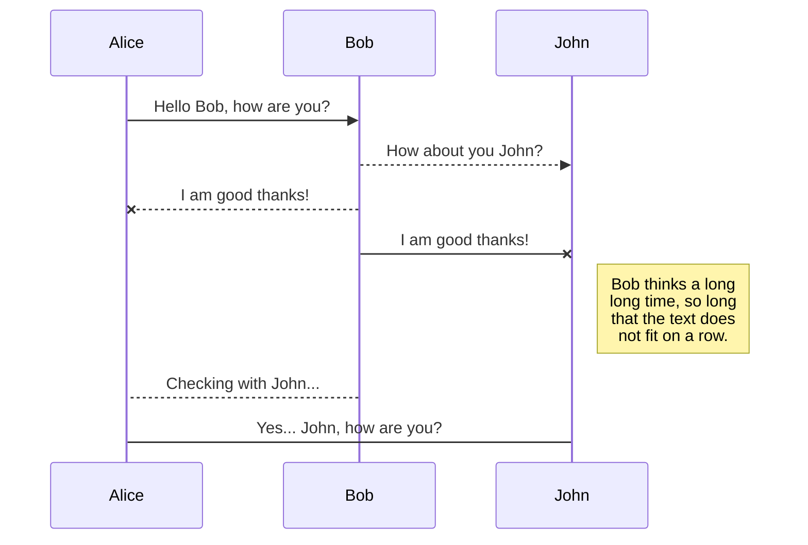
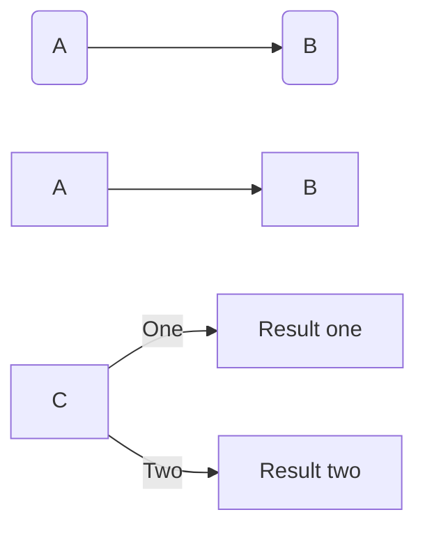

Grt learning seminar 2019
=========================

|Day | Speaker | Title | Abstract |
|---|---|---|---|
|Sept 20| Stefan Dawydiak | [Refresher](https://hackmd.io/@adranows/HJhS8uGwB/edit) | Based on examples from e.g. [Justin Campbell's notes](https://pdfs.semanticscholar.org/4b96/c05430d9c9af2beee88f2fa58628b9540d8d.pdf). |
|Sept 27| Dylan Butson | [Overview](db1.pdf) | I will give an overview talk about the first few topics of the seminar, which are: $D$ modules, the Riemann-Hilbert correspondence, and Beilinson-Bernstein localization. I will try to give a very explicit, calculation-based introduction to these topics, focusing on the example of $\mathbb P^1$ (which will explain the representation theory of $\mathfrak{sl}_2$) without worrying too much about technical points. In the following weeks we will try to fill in the details of these arguments, but I thought it would be good for everyone to be on the same page about what we're trying to understand, so that we're motivated for the more technical talks.|
|Oct 4| Benjamin Gammage | [Introduction to Springer Theory](bg1.pdf) | We survey some main ideas surrounding springer theory, focusing on simple examples. References: [de Cataldo-Migliorini Section 4.2](https://arxiv.org/pdf/0712.0349.pdf), [Yun Lecture 1](https://arxiv.org/pdf/1602.01451.pdf), [Chris Elliott's talk notes on a related paper](https://people.math.umass.edu/~celliott/Borho_Macpherson_talk.pdf), and Nadler’s general perspective of which a brief summary can be found at the beginning of [this paper](https://arxiv.org/pdf/1302.7053.pdf).|
|Oct 11| Balazs Elek | [Geometry of the Flag Variety](be1.pdf) | We will review some geometry of the flag variety and introduce Bott-Samelson varieties in order to do some computations generalizing those we saw on $\mathbb P^1$ for $SL_2$. | 
|Oct 18| Dylan Butson | [Technical Introduction to $D$ modules/Beilinson-Bernstein Localization for $SL_3$](db3.pdf) | In the first half, I will give a more careful introduction to the theory of $D$ modules. In the second half, I will give a detailed statement of the Beilinson-Berstein equivalence and revisit the derivation of the BGG resolution for $L(0)$ from the geometry of the flag variety in the $SL_2$ and $SL_3$ examples, following the calculations Balazs Elek explained last time. [Attached are some notes](db2.pdf) I wrote about the 6 functors formalism for $D$ modules. I won't exactly follow these notes in my talk, but they carefully explain the conventions that I will use (which are not completely standard, despite being canonical) and might be helpful to look at before/during/after the talk. This should be the last talk on BB localization and D modules for now, but we will return to these topics when we discuss the proof of the Kahzdan-Lusztig conjectures. |
| Oct 25 | Stefan Dawydiak | [Reminder on perverse sheaves and the equivariant derived category](sd1.pdf) | In the first half, I'll give a reminder on perverse sheaves, beginning with recalling the definition of the perverse $t$-structure on $D^b_c(X)$ before recalling the various exactness results we proved last year. These will be illustrated by a series of example computations, which will be either parallel to computations we've hopefully all seen in category $\mathcal O$, or will be continuations of the exercises done in the first reminder talk on constructible sheaves. The second half will introduce the Bernstein-Lunts equivariant derived category. Equivariant derived categories will feature heavily in the applications chapters, and we'll begin by briefly motivating them by considering their analogues on the level of functions. We will follow a mixture of Achar ch. 6 and Ch. 2 and 3 of Bernstein, Lunts, Equivariant sheaves and functors.|
|Nov 1 |Dylan Butson |[The Riemann-Hilbert correspondence, toward the proof of the Kazhdan-Lusztig conjecture](db4.pdf) |In the first half, I will outline a proof of the Riemann-Hilbert correspondence. In the second half, I will discuss equivariant $D$ modules, the relation of equivariance to integrability of $\mathfrak g$-modules under Beilinson-Bernstein localization, and explain how this allows us to reduce the Kazhdan-Lusztig conjecture to a statement about $B$ equivariant sheaves on $G/B$. |
|Nov 8 |Stefan Dawydiak |[Statement of proof of the Kazhdan-Lusztig conjecture](sd2.pdf) | In the first part of the talk, I'll define the Hecke algebra and formulate Kazhdan-Lusztig conjectures. The Hecke algebra is equipped with three natural bases and an involution, and we will see what this data corresponds to in each of *principal block of category $\mathcal O$*, *$B$-equivariant $D$-modules on $G/B$*, and *$B$-equivariant sheaves on $G/B$*. I'll talk about the category of $B$-equivariant perverse sheaves on $G/B$ and how to convolve them (it is this operation which requires visiting the equivariant derived category), which will lead to a categorification of the Hecke algebra in terms of the additive category of the so-called semisimple complexes. From here we will be able to prove the conjecture and comment on categorifications of Hecke algebras in other contexts. The talk is based primarily on sections 7.1 through 7.3 of Achar, but see also Kostya's notes from the seminar last year for an alternative proof of the Kazhdan-Lusztig conjectures which does not require the equivariant derived category, but which also does not give a categorification of the Hecke algebra. | 
|Nov 15 | Pavel Shlykov | Preliminaries on Springer correspondence | I will try to review the Chriss-Ginzburg style construction of the Springer correspondence and show you by the clumsiness of my computations, that perverse sheaves (which I won't use at all) should be a better tool. | 
| Nov 22 | Suriya Raghavendran | More on the Springer correspondence | TBA|
| Nov 29 | Anne Dranowski | Geoemtric Satake correspondece 1 | TBA |
| Dec 6 | Roger Bai | Geometric Satake correspondence 2 | TBA |
| X | Y | Z | References: [Coherent sheaves on $\mathbb P^n$ and problems of linear algebra](beil.pdf) |

<!-- Dylan Butson Oct 18 We will give a technical introduction to the theory of $D$ modules and write down resolutions in terms of moment graphs.
Stefan Dawydiak Oct 25 Give a recap about perverse and constructible sheaves, and define the equivariant derived category following chapter 6 in Achar. -->

